#Domain model and design

##Domain model
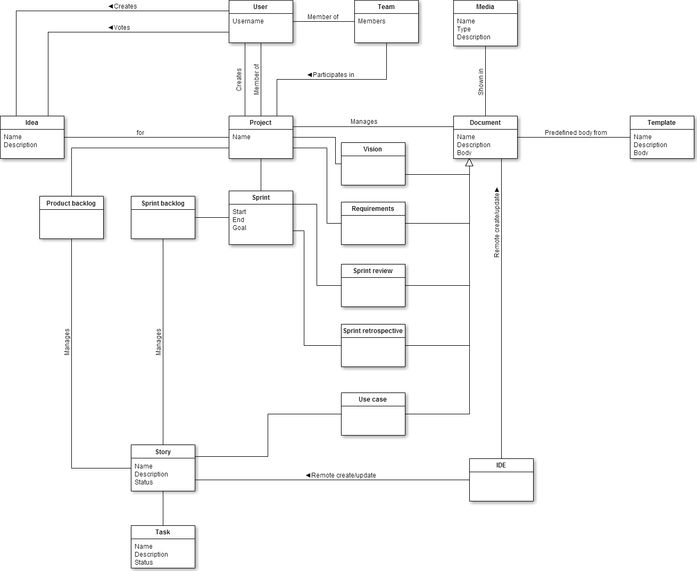

##Package overview
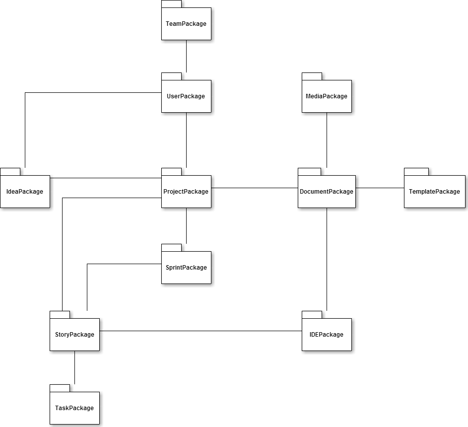

##TeamPackage
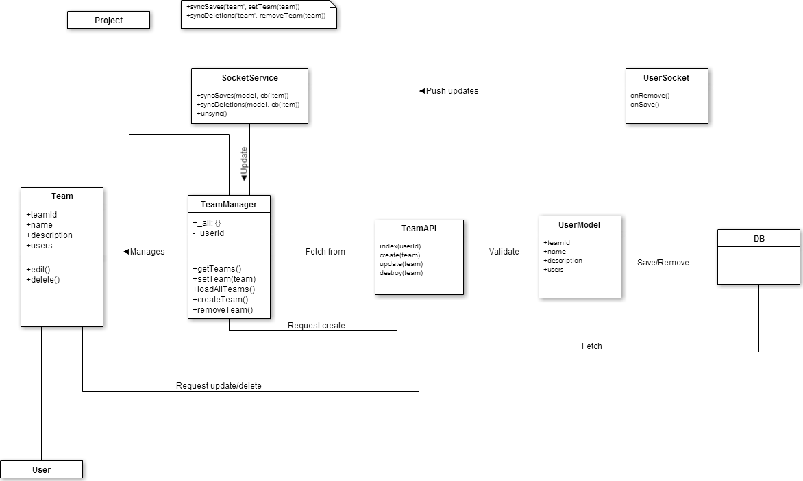

##UserPackage
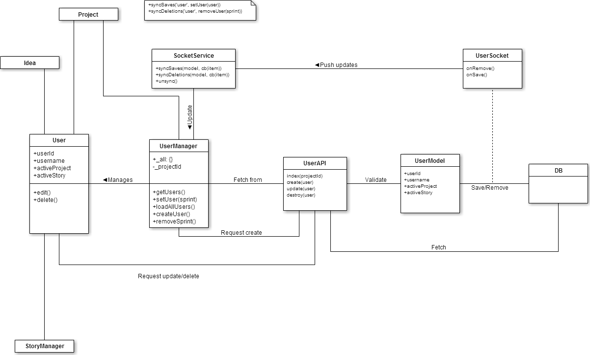

##ProjectPackage
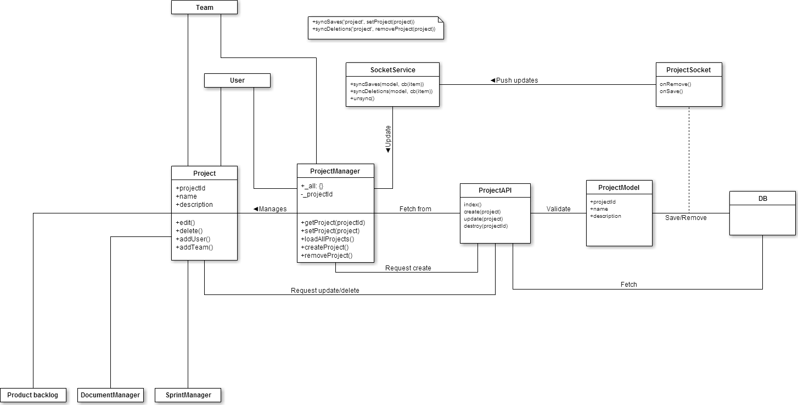

##SprintPackage
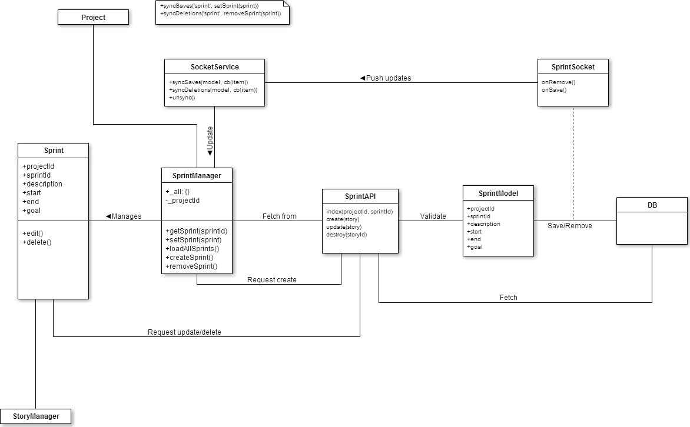

##StoryPackage
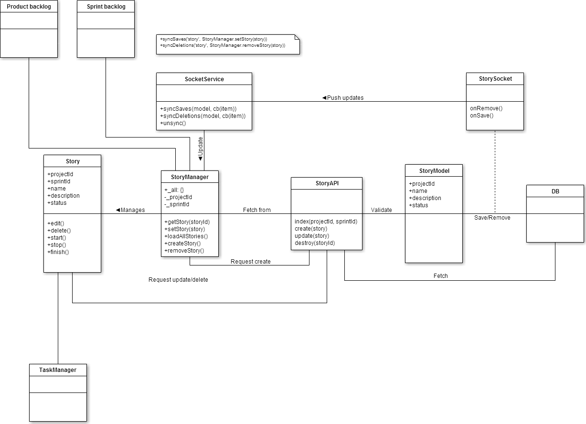

##TaskPackage
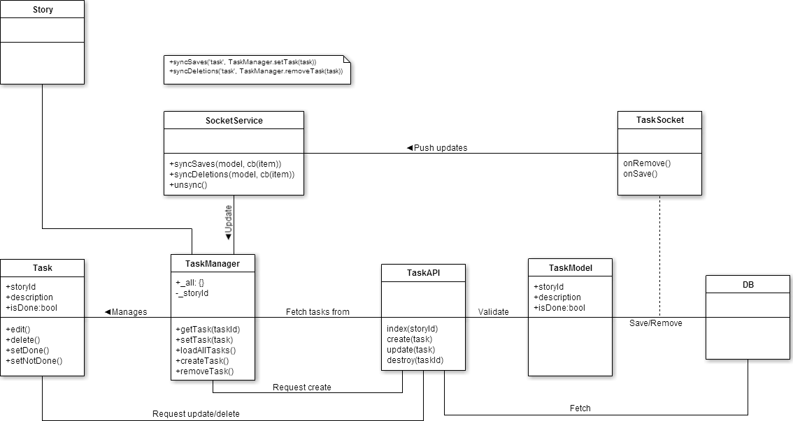

##IdeaPackage
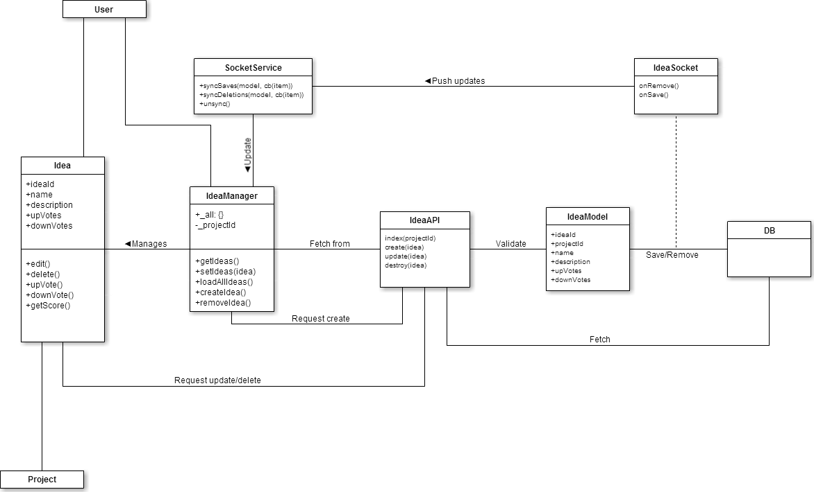

##DocumentPackage
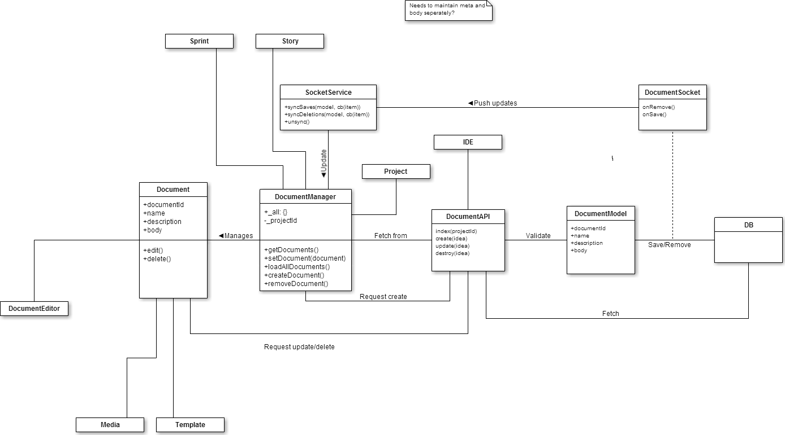

##MediaPackage
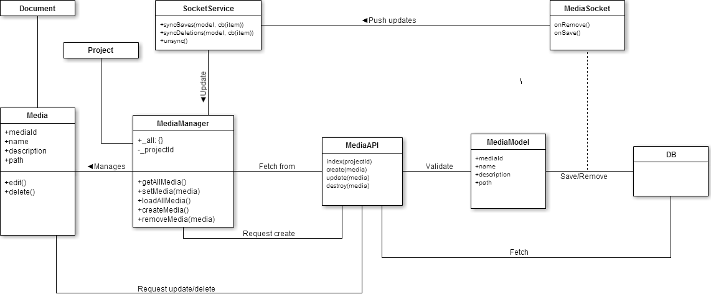

##TemplatePackage
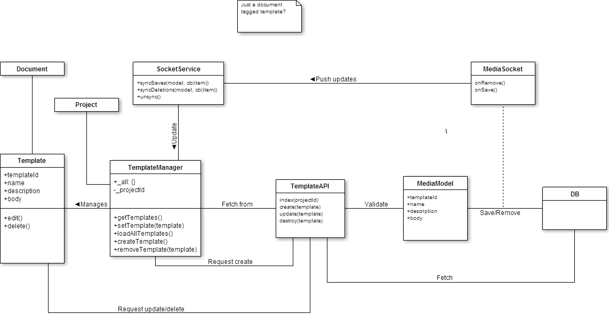

##IDEPackage
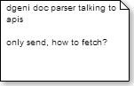
