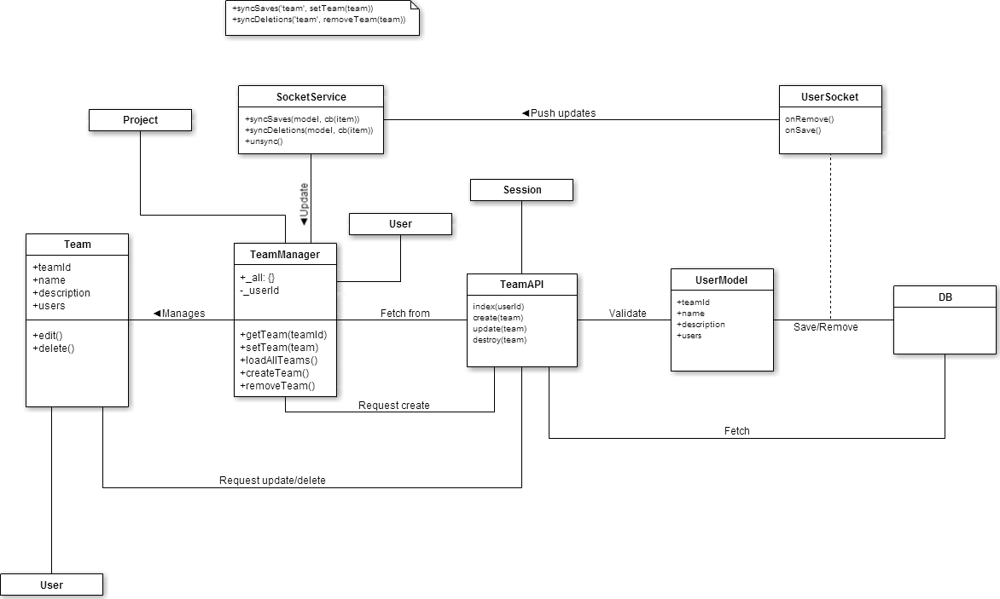
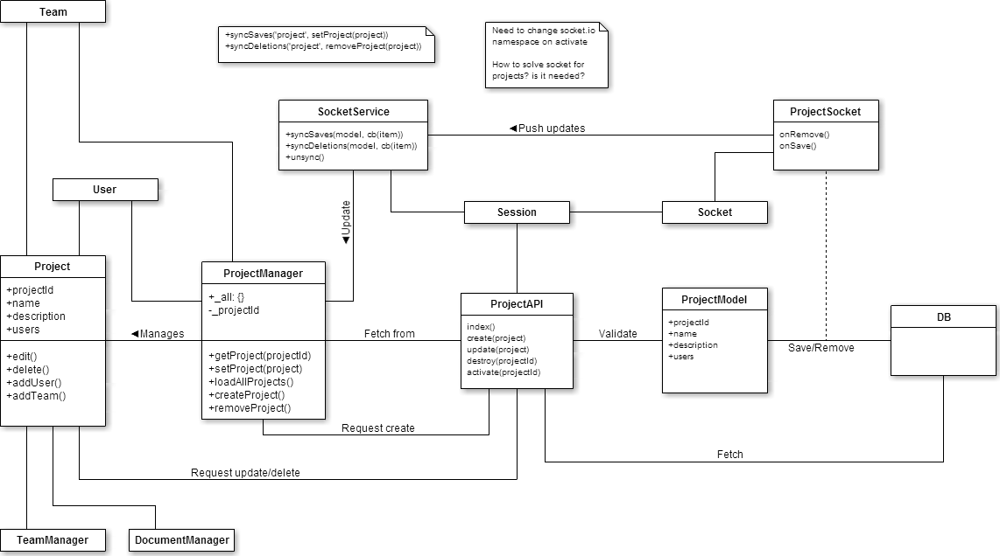
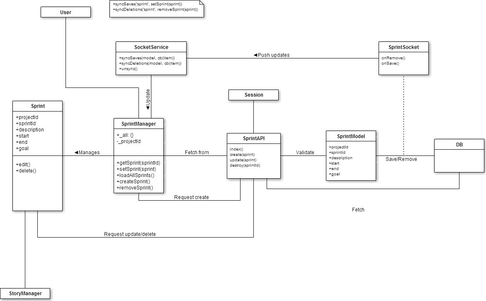
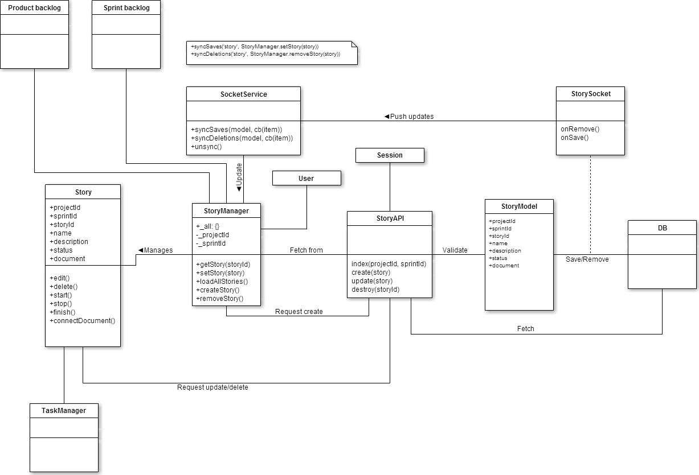
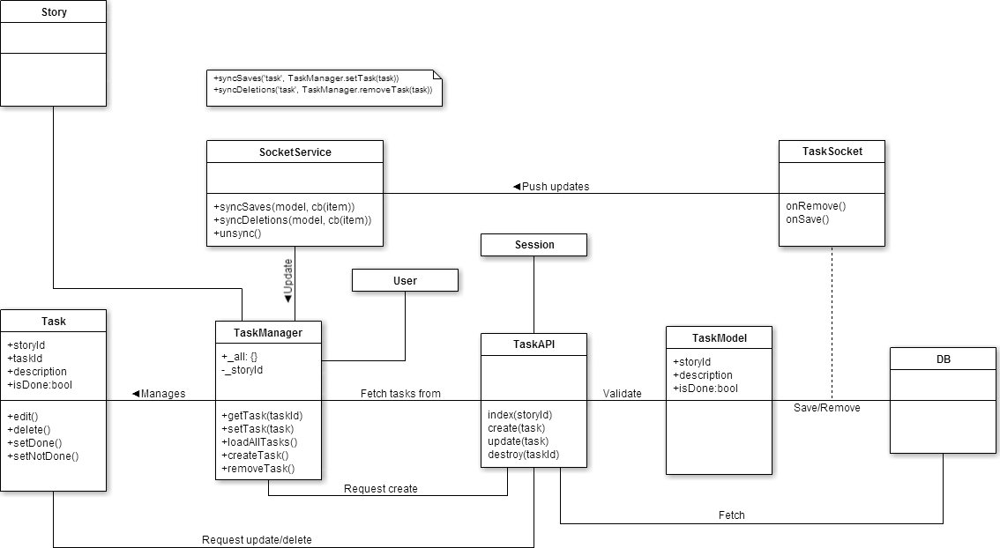
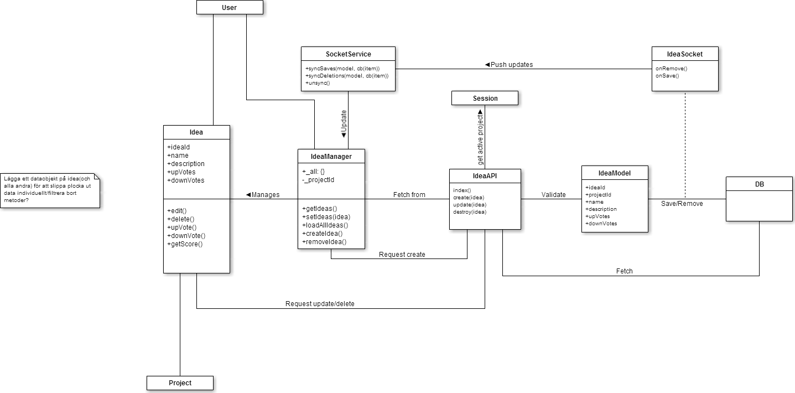
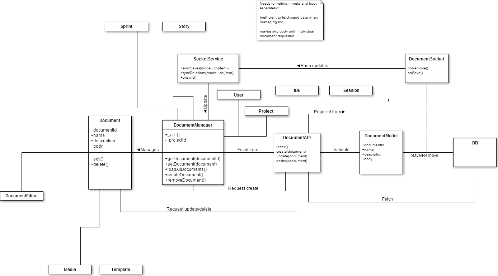
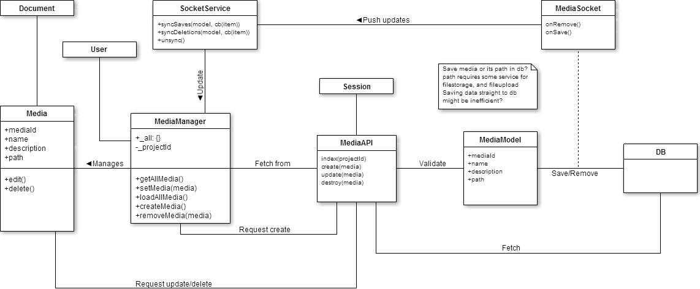
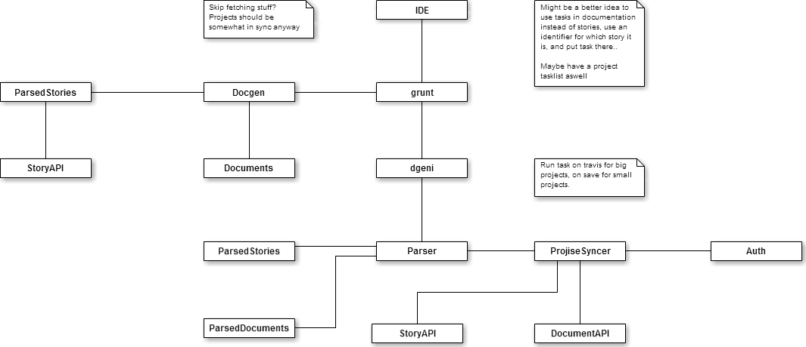

#Domain model and design

##Domain model

##Package overview

##TeamPackage

##UserPackage

##ProjectPackage

##SprintPackage

##StoryPackage

##TaskPackage

##IdeaPackage

##DocumentPackage

##MediaPackage

##TemplatePackage

##IDEPackage

